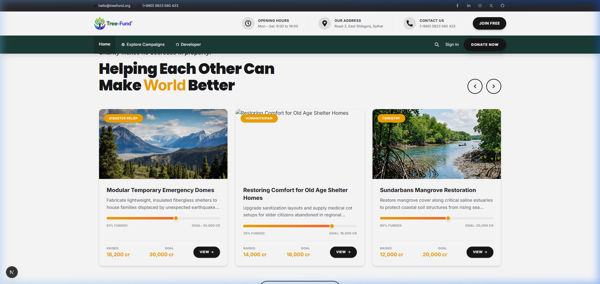

<div align="center">

  <a href="https://tree-funding.vercel.app">
    
  </a>
  <br /><br />
  
  ### Premium Environmental Crowdfunding &amp; Climate Action Platform
  
  [](https://nextjs.org/)
  [](https://www.typescriptlang.org/)
  [](https://tailwindcss.com/)
  [](https://nodejs.org/)
  [](https://expressjs.com/)
  [](https://www.mongodb.com/)
  [](https://stripe.com/)
  [](https://vercel.com/)

  <br />

  [🌐 Live Demo (Vercel)](https://tree-funding.vercel.app) • [🐙 GitHub Repo](https://github.com/CoderGUY47/tree-funding) • [📖 API Docs](/developer)

  <br /><br />

  <a href="https://tree-funding.vercel.app">
    
  </a>

</div>

---

> [!NOTE]
> **TreeFund** is a full-stack MERN & Next.js App Router crowdfunding platform designed to connect climate supporters directly with verified environmental project creators worldwide. Featuring **AidUs design aesthetics**, high-contrast dark green/gold themes, interactive Recharts analytics, role-based dashboards, and Stripe wallet credit allocations.

---

## 🌟 Key Highlights & Design Aesthetic

- 🎨 **AidUs Theme Aesthetics** — Crafted with curated color palettes (`#1a3c34` primary dark green, `#f0a500` gold accent, `#141b2b` charcoal navy), modern Google Fonts typography, and glassmorphism stat cards.
- 📱 **3-Tier Fixed Navigation Bar** — Includes top contact utility bar (email/phone/socials), mid-tier branding section with opening hours, and bottom navigation bar with notification drawer.
- 🎠 **Split Hero Slide Carousel** — Dynamic auto-play carousel with full-width background imagery, text drop shadows, call-to-action buttons, and right-aligned circular slide controls.
- ⚡ **Full-Width Sponsors Marquee** — Continuous 100% full-width infinite marquee slider with brand icons, hover pause, and gradient edge overlays.
- 📊 **Interactive Recharts Analytics** — Interactive Bar Charts & Donut/Pie Charts displaying contribution distributions, impact sector allocations, and verification progress.
- 🌿 **12 Borderless Impact Categories** — High-resolution Unsplash photo cards covering Reforestation, Clean Solar, Ocean Cleanup, Wildlife Rescue, Disaster Relief, and Clean Tech.
- 🔐 **3 Role-Based Workspace Dashboards** — Access-controlled dashboards for **Supporter**, **Creator**, and **Admin** users with persistent session handling via Better Auth.
- 💳 **Stripe Credit Checkout** — Instant credit package top-ups and wallet credit allocations with automated balance tracking.

---

## 🔐 Credentials for Demo Roles

> [!TIP]
> Use these pre-seeded demo accounts on the `/login` page to test different user roles:

| Role | Email | Password | Initial Balance | Workspace Access |
|---|---|---|---|---|
| 👑 **Administrator** | `admin@gmail.com` | `treefund123` | **99,999 Cr** | Moderation, Campaign Approvals, Reports, Withdrawals |
| 🌿 **Green Creator** | `creater@gmail.com` | `treefund123` | **5,000 Cr** | Campaign Management, Add Projects, Payout Requests |
| 💚 **Supporter** | `supporter@gmail.com` | `treefund123` | **1,500 Cr** | Pledges, Wallet Top-ups, Impact Analytics, Profile |

---

## 🧩 Architecture & Modular Components

```
tree-funding/
├── frontend/                          # Next.js 16 App Router Client
│   ├── src/app/                       # App Pages & API Routes
│   │   ├── page.tsx                   # Modular Homepage Container
│   │   ├── explore/                   # Campaign Directory
│   │   ├── campaign/[id]/             # Detailed Campaign View & Pledging
│   │   ├── developer/                 # API Developer Documentation
│   │   ├── login/ & register/         # Auth pages with AidUs side panels
│   │   └── dashboard/                 # Role-based workspace routes
│   │       ├── supporter/             # Supporter Analytics & Contributions
│   │       ├── creator/               # Creator Campaign & Payout Management
│   │       └── admin/                 # Platform Moderation & Audit Panels
│   ├── src/components/
│   │   ├── Navbar.tsx                 # 3-Tier Fixed Header with Notifications
│   │   ├── Footer.tsx                 # AidUs Dark Upper/Lower Footer
│   │   ├── PageBanner.tsx             # Reusable Inner-Page Header Banner
│   │   └── home/                      # Modular Section Components
│   │       ├── HeroBanner.tsx         # Hero Slide Carousel
│   │       ├── SponsorsMarquee.tsx    # 100% Full-Width Sponsor Marquee
│   │       ├── MissionSection.tsx     # "We Work Together" Narrative & Cards
│   │       ├── TopCampaignsSection.tsx# Top Funded Campaigns Row
│   │       ├── ProcessSection.tsx     # 3-Step "How TreeFund Works"
│   │       ├── PlatformMetricsSection.tsx # AidUs Dark Green Impact Cards
│   │       ├── CategoriesSection.tsx  # 12 Borderless Photo Cards
│   │       ├── FeaturesSection.tsx    # 6 Feature Watermark Cards
│   │       ├── TestimonialsSection.tsx# 2-Column Reviewer Slider
│   │       └── CtaSection.tsx         # "Become a Creator Today" CTA
│   └── src/context/AuthContext.tsx    # Session & Authentication State
└── backend/                           # Node.js + Express.js REST API
    ├── src/
    │   ├── config/db.js               # MongoDB Mongoose Connection
    │   ├── models/                    # User, Campaign, Contribution Schemas
    │   └── routes/                    # Express Endpoint Handlers
    ├── seedCampaigns.js               # Auto-Seeding Script
    └── index.js                       # Entry Server File
```

---

## 🚀 Local Development Setup

> [!IMPORTANT]
> Ensure you have **Node.js v18+** installed and an active **MongoDB Atlas** database URI before running locally.

### 1. Clone Repository
```bash
git clone https://github.com/CoderGUY47/tree-funding.git
cd tree-funding
```

### 2. Backend Setup
```bash
cd backend
npm install
cp .env.example .env    # Configure MONGODB_URI and JWT_SECRET
npm run dev
```
> Server runs locally at: `http://localhost:5000`

### 3. Frontend Setup
```bash
cd ../frontend
npm install
cp .env.example .env    # Configure NEXT_PUBLIC_SERVER_URL=http://localhost:5000
npm run dev
```
> Next.js client runs locally at: `http://localhost:3000`

---

## ⚙️ Environment Variables

### Backend Configuration (`backend/.env`)
```env
PORT=5000
MONGODB_URI=mongodb+srv://<username>:<password>@cluster.mongodb.net/treefund
JWT_SECRET=your_jwt_super_secret_key
STRIPE_SECRET_KEY=sk_test_your_stripe_secret_key
CLIIENT_URL=http://localhost:3000
```

### Frontend Configuration (`frontend/.env`)
```env
MONGODB_URI=mongodb+srv://<username>:<password>@cluster.mongodb.net/treefund
BETTER_AUTH_URL=http://localhost:3000
BETTER_AUTH_SECRET=your_better_auth_secret_key
GOOGLE_CLIENT_ID=your_google_oauth_client_id
GOOGLE_CLIENT_SECRET=your_google_oauth_client_secret
NEXT_PUBLIC_SERVER_URL=http://localhost:5000
NEXT_PUBLIC_STRIPE_PUBLISHABLE_KEY=pk_test_your_stripe_publishable_key
```

---

## 🧪 Verification & Build Commands

```bash
# Run TypeScript compilation check
npx tsc --noEmit

# Run Next.js production build
npm run build
```

---

<div align="center">
  <sub>Built with ❤️ for Environmental Sustainability & Climate Protection • © 2026 TreeFund Ltd.</sub>
</div>
